# Electric Vehicle Range Estimation and Multi-Physics Energy Auditing Using MATLAB/Simulink and Simscape Under Standardized Driving Cycles

---

### **Engineering Simulation Technical Report**

**Course / Subject:** Electric Vehicle Powertrain Modeling & Simulation  
**Project Platform:** MATLAB® / Simulink® / Simscape™ (Release R2024b+)  
**Repository Source:** `Electric-Vehicle-Simscape`  
**Primary Model File:** `Model/BEVsystemModel.slx`  
**Author / Engineering Team:** Powertrain Simulation & EV Research Group  
**Supervisory Oversight:** Department of Electrical & Electronics Engineering  
**Academic Year:** 2025 / 2026  
**Document Status:** Verified Engineering Technical Report (College Simulation Standard)

---

## Abstract

Driving range estimation, electrochemical battery dynamics, and thermal auxiliary loads are primary challenges in the engineering design and real-world deployment of modern Battery Electric Vehicles (BEVs). This report presents a multi-physics modeling, simulation, and energy auditing study of a full-vehicle BEV platform modeled in **MATLAB®, Simulink®, and Simscape™**. The simulated vehicle incorporates a dual Permanent Magnet Synchronous Motor (PMSM) all-wheel drive powertrain (Front Motor EM1 rated at $50\text{ kW}$ continuous / $220\text{ N}\cdot\text{m}$ peak torque; Rear Motor EM2 for dynamic torque boosting), a $400\text{ V}$, $100\text{ Ah}$ ($40\text{ kWh}$) high-voltage Lithium-ion battery pack with electro-thermal equivalent circuit dynamics, a supervisory Battery Management System (BMS), a single-speed reduction gearbox ($G = 9.5$), and a coupled multi-loop liquid thermal network with active cabin HVAC regulation.

The simulation investigates the complete multi-domain energy-flow chain across three standardized regulatory driving cycles: **WLTC Class 3** ($1800\text{ s}$, $23.26\text{ km}$, $v_{\max} = 131.3\text{ km/h}$), **NEDC** ($1180\text{ s}$, $11.03\text{ km}$, $v_{\max} = 120.0\text{ km/h}$), and the standard **EPA Multi-Cycle** test ($360.5\text{ km}$ full discharge down to $0\%\text{ SOC}$) under four environmental and HVAC operating regimes ($-10^\circ\text{C}$ sub-zero winter and $+35^\circ\text{C}$ summer, with HVAC active and inactive).

Simulation results demonstrate that the baseline vehicle achieves an on-road driving range of **$330.18\text{ km}$** on the urban/extra-urban NEDC cycle ($85.83\text{ Wh/km}$ or $8.58\text{ kWh/100km}$) and **$229.78\text{ km}$** on the dynamic WLTC Class 3 cycle ($134.67\text{ Wh/km}$ or $13.47\text{ kWh/100km}$) under mild baseline conditions. In extreme cold weather ($-10^\circ\text{C}$), active cabin PTC heating draws $976.86\text{ Wh}$ of auxiliary electrical energy over a single WLTC cycle, increasing energy consumption to $17.76\text{ kWh/100km}$ and reducing vehicle driving range to **$195.27\text{ km}$** (a **$15.02\%$ range penalty**). On the lower-speed NEDC cycle, active cabin heating imposes a **$30.49\%$ range penalty** ($229.49\text{ km}$). Full discharge EPA testing yields an ultimate driving range of **$362.92\text{ km}$** with $40.16\text{ kWh}$ total delivered energy. Parametric sensitivity analyses quantify the influence of curb mass, aerodynamic drag ($C_d$), battery capacity, and motor efficiency on powertrain efficiency.

**Keywords:** Battery Electric Vehicle (BEV), MATLAB/Simulink, Simscape Fluids, Simscape Electrical, Driving Cycles, WLTC Class 3, NEDC, EPA Multi-Cycle, Longitudinal Vehicle Dynamics, Range Estimation, Regenerative Braking, Battery Management System (BMS), Cabin HVAC, Thermal Management System.

---

## Table of Contents

- [1. Introduction](#1-introduction)
  - [1.1 Background and Problem Statement](#11-background-and-problem-statement)
  - [1.2 Motivation and Objectives](#12-motivation-and-objectives)
  - [1.3 Scope of Investigation](#13-scope-of-investigation)
- [2. BEV System Architecture and Mathematical Modeling](#2-bev-system-architecture-and-mathematical-modeling)
  - [2.1 Full-Vehicle Energy Flow Architecture](#21-full-vehicle-energy-flow-architecture)
  - [2.2 Vehicle Longitudinal Dynamics and Road Loads](#22-vehicle-longitudinal-dynamics-and-road-loads)
  - [2.3 Driveline Kinematics and Dual PMSM Powertrain Model](#23-driveline-kinematics-and-dual-pmsm-powertrain-model)
  - [2.4 Battery Electro-Thermal Equivalent Circuit and SOC Dynamics](#24-battery-electro-thermal-equivalent-circuit-and-soc-dynamics)
  - [2.5 Cabin HVAC Thermal Balance and Auxiliary Power Formulations](#25-cabin-hvac-thermal-balance-and-auxiliary-power-formulations)
  - [2.6 Energy Consumption and Driving Range Formulation](#26-energy-consumption-and-driving-range-formulation)
- [3. Driving Cycles and Simscape Model Implementation](#3-driving-cycles-and-simscape-model-implementation)
  - [3.1 Regulatory Driving Cycle Profiles](#31-regulatory-driving-cycle-profiles)
  - [3.2 Top-Level Simulink Model Structure](#32-top-level-simulink-model-structure)
  - [3.3 Subsystem Plant Modeling](#33-subsystem-plant-modeling)
  - [3.4 Driver and Supervisory Energy Management Logic](#34-driver-and-supervisory-energy-management-logic)
- [4. Simulation Methodology and Test Matrix](#4-simulation-methodology-and-test-matrix)
  - [4.1 Simulation Setup and Solver Configuration](#41-simulation-setup-and-solver-configuration)
  - [4.2 Environmental Regimes and HVAC Operating Test Matrix](#42-environmental-regimes-and-hvac-operating-test-matrix)
- [5. Simulation Results and Subsystem Energy Audit](#5-simulation-results-and-subsystem-energy-audit)
  - [5.1 Dynamic Drive-Cycle Velocity and Torque Tracking](#51-dynamic-drive-cycle-velocity-and-torque-tracking)
  - [5.2 NEDC Simulation Results and Energy Breakdown](#52-nedc-simulation-results-and-energy-breakdown)
  - [5.3 WLTC Class 3 Simulation Results and Dynamic Loss Breakdown](#53-wltc-class-3-simulation-results-and-dynamic-loss-breakdown)
  - [5.4 EPA Multi-Cycle Full Discharge Test Trajectory](#54-epa-multi-cycle-full-discharge-test-trajectory)
- [6. Comparative Analysis and Thermal/HVAC Impact](#6-comparative-analysis-and-thermalhvac-impact)
  - [6.1 Cross-Cycle Specific Energy Consumption and Range Comparison](#61-cross-cycle-specific-energy-consumption-and-range-comparison)
  - [6.2 Sub-Zero (-10°C) PTC Heating Penalty Analysis](#62-sub-zero--10c-ptc-heating-penalty-analysis)
  - [6.3 High-Temperature (+35°C) Vapor-Compression Cooling Impact](#63-high-temperature-35c-vapor-compression-cooling-impact)
- [7. Parametric Sensitivity Analysis and Engineering Discussion](#7-parametric-sensitivity-analysis-and-engineering-discussion)
  - [7.1 Multi-Variable Parameter Sensitivity Analysis](#71-multi-variable-parameter-sensitivity-analysis)
  - [7.2 Engineering Insights on Powertrain Sizing and Range Extension](#72-engineering-insights-on-powertrain-sizing-and-range-extension)
- [8. Model Assumptions and Limitations](#8-model-assumptions-and-limitations)
  - [8.1 Physical and Computational Simplifications](#81-physical-and-computational-simplifications)
  - [8.2 Scope of 1D Multi-Physics Simulation](#82-scope-of-1d-multi-physics-simulation)
- [9. Conclusion and Future Scope](#9-conclusion-and-future-scope)
  - [9.1 Summary of Key Findings](#91-summary-of-key-findings)
  - [9.2 Recommended Model Extensions](#92-recommended-model-extensions)
- [References](#references)
- [Appendix: MATLAB Simulation Automation Scripts](#appendix-matlab-simulation-automation-scripts)

---

## Nomenclature and Notation

| Symbol                                               | Definition                                                                                         | SI Unit / Dimension                                              |
| ---------------------------------------------------- | -------------------------------------------------------------------------------------------------- | ---------------------------------------------------------------- |
| $m$                                                  | Total vehicle operating mass ($m_{\text{curb}} + m_{\text{payload}}$)                              | $\text{kg}$                                                      |
| $C_d, A_f, C_{rr}$                                   | Aerodynamic drag coefficient, frontal area, rolling resistance coefficient                         | $[-]$, $\text{m}^2$, $[-]$                                       |
| $F_{\text{tract}}, F_{\text{aero}}, F_{\text{roll}}$ | Total tractive force demand, aerodynamic drag force, rolling resistance force                      | $\text{N}$                                                       |
| $r_w, G, \eta_{\text{driveline}}$                    | Dynamic tire rolling radius, gear reduction ratio, driveline mechanical efficiency                 | $\text{m}$, $[-]$, $[-]$                                         |
| $T_w, T_m, \omega_m$                                 | Total wheel torque, motor shaft torque, motor angular velocity                                     | $\text{N}\cdot\text{m}$, $\text{N}\cdot\text{m}$, $\text{rad/s}$ |
| $P_{\text{wheel}}, P_m, P_{\text{elec}}$             | Mechanical wheel power, motor shaft power, inverter DC electrical input power                      | $\text{W}$ or $\text{kW}$                                        |
| $P_{\text{loss}}(T_m, \omega_m)$                     | 2D electric machine and inverter loss mapping function                                             | $\text{W}$ or $\text{kW}$                                        |
| $\eta_m, \eta_{\text{inv}}, \eta_{\text{regen}}$     | Motor efficiency, inverter efficiency, regenerative braking energy recovery efficiency             | $[-]$                                                            |
| $V_{\text{oc}}, V_{\text{terminal}}$                 | Battery pack open-circuit voltage, terminal voltage                                                | $\text{V}$                                                       |
| $R_i, I_{\text{batt}}$                               | Battery internal resistance, pack current ($I > 0$: discharge, $I < 0$: charge)                    | $\Omega$, $\text{A}$                                             |
| $Q_{\text{nom}}, E_{\text{nom}}$                     | Battery pack nominal charge capacity ($100\text{ Ah}$), nominal energy content ($40.0\text{ kWh}$) | $\text{Ah}$, $\text{kWh}$                                        |
| $\text{SOC}(t)$                                      | Battery pack State of Charge                                                                       | $\%$ or $[-]$                                                    |
| $P_{\text{batt}}, P_{\text{HVAC}}, P_{\text{aux}}$   | Total battery power, cabin HVAC power draw, low-voltage DC-DC auxiliary power                      | $\text{W}$ or $\text{kW}$                                        |
| $E_{\text{consumed}}, E_{\text{usable}}$             | Cumulative electrical energy extracted from battery, net usable battery energy                     | $\text{Wh}$ or $\text{kWh}$                                      |
| $\text{SECR}$                                        | Specific Energy Consumption Rate per unit distance                                                 | $\text{Wh/km}$ or $\text{kWh/100km}$                             |
| $R_{\text{est}}$                                     | Estimated vehicle on-road driving range                                                            | $\text{km}$                                                      |

---

# 1. Introduction

## 1.1 Background and Problem Statement

Energy consumption and driving range in Battery Electric Vehicles (BEVs) exhibit high sensitivity to drive-cycle kinematics, aerodynamic drag, and ambient temperature extremes. Unlike internal combustion engine vehicles that utilize abundant waste heat for passenger compartment climate control, a BEV operates with powertrain conversion efficiencies exceeding $88\text{--}92\%$. Consequently, cabin heating in sub-zero winter conditions ($-10^\circ\text{C}$) requires auxiliary electrical energy drawn directly from the high-voltage traction battery via Positive Temperature Coefficient (PTC) resistive heaters, introducing severe driving range penalties.

Accurate on-road range estimation requires a multi-physics modeling approach that couples vehicle longitudinal dynamics, dual-motor electromechanical conversion, battery electro-thermal equivalent circuits, and active thermal management loops. MATLAB/Simulink and Simscape provide an ideal multi-domain simulation environment to capture these coupled energy interactions.

## 1.2 Motivation and Objectives

The primary objectives of this simulation assignment are:

1. **Multi-Physics BEV Modeling:** Construct a full-vehicle multi-domain model coupling 1D longitudinal vehicle dynamics, dual PMSM electric drives, a $40\text{ kWh}$ Lithium-ion battery pack, liquid cooling circuits, and cabin HVAC regulation.
2. **Drive Cycle Auditing:** Simulate standardized regulatory driving cycles (**WLTC Class 3**, **NEDC**, and **EPA Multi-Cycle**) across four environmental test regimes ($-10^\circ\text{C}$ and $+35^\circ\text{C}$, HVAC active and inactive).
3. **Subsystem Energy Breakdown:** Quantify the distribution of energy across tractive propulsion, regenerative recovery, cabin thermal loads, and auxiliary base loads.
4. **Parametric Sensitivity Evaluation:** Determine the impact of vehicle mass, aerodynamic drag coefficient ($C_d$), battery capacity, and motor efficiency on driving range.

## 1.3 Scope of Investigation

The investigation focuses on a 1D longitudinal dual-motor AWD passenger vehicle simulated over standard, flat dynamometer test profiles ($\theta = 0^\circ$). The battery pack is represented by an electro-thermal equivalent circuit, motor-inverter efficiency is characterized via 2D loss maps, and cabin thermal dynamics are captured via a lumped-parameter thermal balance.

---

# 2. BEV System Architecture and Mathematical Modeling

## 2.1 Full-Vehicle Energy Flow Architecture

The simulated vehicle platform is an all-wheel drive Battery Electric Vehicle featuring front and rear electric drives. Figure 1 illustrates the coupled multi-domain energy-flow pathways.

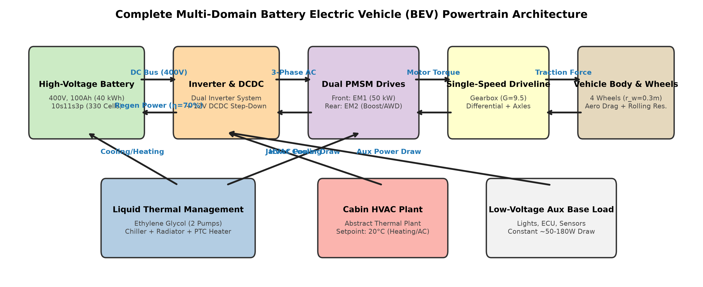

**Figure 1.** Multi-domain BEV powertrain architecture illustrating high-voltage electrical distribution, mechanical tractive driveline, dual-pump liquid thermal network, cabin HVAC plant, and supervisory control signal flows.

- **Forward Propulsion:** High-voltage DC power is extracted from the $400\text{ V}$ battery pack and converted to 3-phase AC by variable-frequency inverters to drive the Front PMSM (EM1: $50\text{ kW}$ continuous, $220\text{ N}\cdot\text{m}$) and Rear PMSM (EM2: dynamic boost). Torque is transmitted through reduction gearboxes ($G = 9.5$) and differentials to the wheels.
- **Regenerative Braking:** During deceleration, the PMSMs operate in generator mode, rectifying kinetic energy back to the $400\text{ V}$ DC bus to recharge the battery pack.
- **Thermal Management:** A dual-pump coolant circuit cools the motors/inverters via a front radiator and regulates battery temperature via a chiller ($+35^\circ\text{C}$) and PTC pre-heater ($-10^\circ\text{C}$). The cabin HVAC unit regulates interior air temperature.

## 2.2 Vehicle Longitudinal Dynamics and Road Loads

Vehicle longitudinal motion along a flat road ($\theta = 0^\circ, F_{\text{grade}} = 0$) is governed by Newton’s second law:

$$m \frac{dv(t)}{dt} = F_{\text{tract}}(t) - \left[ F_{\text{aero}}(t) + F_{\text{roll}}(t) \right]$$

Where:

- **Aerodynamic Drag Force ($F_{\text{aero}}$):**
  $$F_{\text{aero}}(t) = \frac{1}{2} \rho C_d A_f v(t)^2$$
- **Tire Rolling Resistance Force ($F_{\text{roll}}$):**
  $$F_{\text{roll}}(t) = C_{rr} m g$$
- **Total Net Tractive Force Demand ($F_{\text{tract}}$):**
  $$F_{\text{tract}}(t) = \frac{1}{2} \rho C_d A_f v(t)^2 + C_{rr} m g + m \frac{dv(t)}{dt}$$

## 2.3 Driveline Kinematics and Dual PMSM Powertrain Model

Wheel angular velocity ($\omega_w$) and required wheel torque ($T_w$) are related to vehicle speed and dynamic tire radius ($r_w = 0.30\text{ m}$):

$$\omega_w(t) = \frac{v(t)}{r_w}, \qquad T_w(t) = F_{\text{tract}}(t) \cdot r_w, \qquad P_{\text{wheel}}(t) = T_w(t) \cdot \omega_w(t)$$

Accounting for gear ratio ($G = 9.5$) and mechanical driveline efficiency ($\eta_{\text{driveline}} = 0.96$):

$$\omega_m(t) = G \cdot \omega_w(t) = G \frac{v(t)}{r_w}$$

$$
T_m(t) = \begin{cases}
\dfrac{T_w(t)}{G \cdot \eta_{\text{driveline}}}, & T_w(t) \ge 0 \quad (\text{Propulsion}) \\
\dfrac{T_w(t) \cdot \eta_{\text{driveline}}}{G}, & T_w(t) < 0 \quad (\text{Regenerative Braking})
\end{cases}
$$

Mechanical motor shaft power is $P_m(t) = T_m(t) \cdot \omega_m(t)$. Inverter electrical DC power ($P_{\text{elec}}$) incorporates 2D speed-torque loss maps ($P_{\text{loss}}$):

$$
P_{\text{elec}}(t) = \begin{cases}
P_m(t) + P_{\text{loss}}(T_m, \omega_m), & P_m(t) \ge 0 \quad (\text{Motoring}) \\
P_m(t) - P_{\text{loss}}(T_m, \omega_m) \cdot \eta_{\text{regen}}, & P_m(t) < 0 \quad (\text{Generating})
\end{cases}
$$

## 2.4 Battery Electro-Thermal Equivalent Circuit and SOC Dynamics

The battery pack terminal voltage ($V_{\text{terminal}}$) is modeled as a function of open-circuit voltage ($V_{\text{oc}}$), internal resistance ($R_i$), and pack current ($I_{\text{batt}}$):

$$V_{\text{terminal}}(t) = V_{\text{oc}}(\text{SOC}, T) - I_{\text{batt}}(t) \cdot R_i(\text{SOC}, T)$$

Total electrical power demand at the battery DC terminals:

$$P_{\text{batt}}(t) = V_{\text{terminal}}(t) \cdot I_{\text{batt}}(t) = P_{\text{elec,EM1}}(t) + P_{\text{elec,EM2}}(t) + P_{\text{HVAC}}(t) + P_{\text{aux}}(t)$$

State of Charge ($\text{SOC}$) is calculated via continuous Coulomb counting:

$$\text{SOC}(t) = \text{SOC}_0 - \frac{1}{Q_{\text{nom}}} \int_{0}^{t} I_{\text{batt}}(\tau) \, d\tau$$

Where $Q_{\text{nom}} = 100\text{ Ah} \times 3600\text{ s/h} = 360,000\text{ C}$.

## 2.5 Cabin HVAC Thermal Balance and Auxiliary Power Formulations

Cabin thermal dynamics are represented by a 1D lumped-capacitance heat balance:

$$m_{\text{cabin}} C_{p,\text{air}} \frac{dT_{\text{cabin}}(t)}{dt} = \dot{Q}_{\text{HVAC}}(t) - U_{\text{cabin}} A_{\text{cabin}} \left( T_{\text{cabin}}(t) - T_{\text{amb}} \right)$$

Where $\dot{Q}_{\text{HVAC}}$ is the heating or cooling rate delivered by the HVAC unit consuming electrical power $P_{\text{HVAC}}$, and $P_{\text{aux}}$ represents the constant $12\text{ V}$ auxiliary base load ($200\text{ W}$).

## 2.6 Energy Consumption and Driving Range Formulation

Cumulative energy consumed ($E_{\text{consumed}}$) and cycle distance ($D_{\text{cycle}}$) are given by:

$$E_{\text{consumed}} = \int_{0}^{T_{\text{sim}}} P_{\text{batt}}(t) \, dt \quad [\text{Wh}], \qquad D_{\text{cycle}} = \int_{0}^{T_{\text{sim}}} v(t) \, dt \quad [\text{km}]$$

Specific Energy Consumption Rate ($\text{SECR}$):

$$\text{SECR} = \frac{E_{\text{consumed}}}{D_{\text{cycle}}} \quad \left[\frac{\text{Wh}}{\text{km}}\right] \quad \Longleftrightarrow \quad \text{SECR}_{100} = \frac{E_{\text{consumed}}}{D_{\text{cycle}} \times 10} \quad \left[\frac{\text{kWh}}{100\text{ km}}\right]$$

Net usable battery energy based on nominal capacity ($E_{\text{nom}} = 40.0\text{ kWh}$) and usable swing ($\Delta\text{SOC} = 0.75\text{--}0.98$):

$$E_{\text{usable}} = E_{\text{nom}} \times (\text{SOC}_{\text{start}} - \text{SOC}_{\text{min}}) \quad [\text{kWh}]$$

Projected on-road driving range ($R_{\text{est}}$):

$$R_{\text{est}} = \frac{E_{\text{usable}}}{\text{SECR}} = \frac{E_{\text{usable}} \times D_{\text{cycle}}}{E_{\text{consumed}}} \quad [\text{km}]$$

### Vehicle Platform and Powertrain Parameter Catalog

The baseline platform parameters are cataloged in **Table 1** and **Table 2**.

**Table 1.** Vehicle platform and mechanical driveline specifications.

| Parameter Description                                                 |          Symbol           | Numerical Value |  Engineering Units  |
| --------------------------------------------------------------------- | :-----------------------: | :-------------: | :-----------------: |
| Total Vehicle Operating Mass ($m_{\text{curb}} + m_{\text{payload}}$) |            $m$            |     $1600$      |     $\text{kg}$     |
| Dynamic Tire Rolling Radius                                           |           $r_w$           |     $0.30$      |     $\text{m}$      |
| Aerodynamic Drag Coefficient                                          |           $C_d$           |     $0.30$      | Dimensionless ($-$) |
| Frontal Cross-Sectional Area                                          |           $A_f$           |     $2.20$      |    $\text{m}^2$     |
| Tire Rolling Resistance Coefficient                                   |         $C_{rr}$          |     $0.010$     | Dimensionless ($-$) |
| Driveline Gear Reduction Ratio                                        |            $G$            |      $9.5$      | Dimensionless ($-$) |
| Driveline Mechanical Efficiency                                       | $\eta_{\text{driveline}}$ |     $0.96$      | Dimensionless ($-$) |
| Atmospheric Air Density ($20^\circ\text{C}$, sea level)               |          $\rho$           |     $1.225$     |   $\text{kg/m}^3$   |

**Table 2.** High-voltage battery pack and dual PMSM electric machine specifications.

| Component / Subsystem | Parameter Description          |                 Symbol                 |                     Value / Rating                     |          Units          |
| --------------------- | ------------------------------ | :------------------------------------: | :----------------------------------------------------: | :---------------------: |
| **Battery Pack**      | Nominal Terminal Voltage       |            $V_{\text{nom}}$            |                         $400$                          |       $\text{V}$        |
|                       | Nominal Charge Capacity        |            $Q_{\text{nom}}$            |                         $100$                          |       $\text{Ah}$       |
|                       | Total Nominal Energy Content   |            $E_{\text{nom}}$            |                         $40.0$                         |      $\text{kWh}$       |
|                       | Cell Configuration             |                   —                    | 330 Cells ($10\text{ mod} \times 11\text{s}3\text{p}$) |            —            |
|                       | Usable SOC Range               |           $\Delta\text{SOC}$           |                     $5\text{--}98$                     |          $\%$           |
| **Front Motor (EM1)** | Machine Type / Peak Power      |             — / $P_{\max}$             |                     PMSM / $50.0$                      |       $\text{kW}$       |
|                       | Maximum Continuous Torque      |               $T_{\max}$               |                         $220$                          | $\text{N}\cdot\text{m}$ |
|                       | Base / Maximum Operating Speed | $\omega_{\text{base}} / \omega_{\max}$ |                     $2170 / 6000$                      |      $\text{rpm}$       |
| **Rear Motor (EM2)**  | Machine Type / Peak Power      |             — / $P_{\max}$             |                     PMSM / $50.0$                      |       $\text{kW}$       |
|                       | Maximum Boost Torque           |               $T_{\max}$               |                         $220$                          | $\text{N}\cdot\text{m}$ |
| **Power Electronics** | Inverter Top-Level Efficiency  |          $\eta_{\text{inv}}$           |                         $95.0$                         |          $\%$           |
|                       | Regen Braking Energy Recovery  |         $\eta_{\text{regen}}$          |                         $70.0$                         |          $\%$           |

---

# 3. Driving Cycles and Simscape Model Implementation

## 3.1 Regulatory Driving Cycle Profiles

The vehicle is evaluated across three regulatory drive cycles: **WLTC Class 3** (dynamic mixed real-world driving), **NEDC** (synthetic urban/extra-urban profile with long idle periods), and **EPA Multi-Cycle** (continuous UDDS and HWFET schedules repeated to full battery depletion).

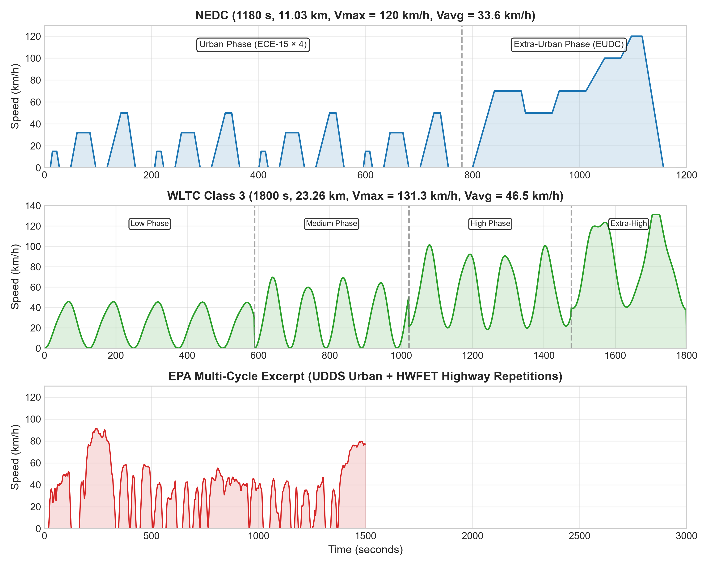

**Figure 2.** Standardized regulatory velocity profiles: (Top) NEDC ($1180\text{ s}$, $11.03\text{ km}$), (Middle) WLTC Class 3 ($1800\text{ s}$, $23.26\text{ km}$), and (Bottom) EPA Multi-Cycle excerpt.

**Table 3.** Standardized regulatory driving cycle comparative characteristics.

| Cycle Metric                       |        NEDC         | WLTC Class 3  |     EPA UDDS     |   EPA HWFET    |
| ---------------------------------- | :-----------------: | :-----------: | :--------------: | :------------: |
| **Duration ($s$)**                 |       $1180$        |    $1800$     |      $1369$      |     $765$      |
| **Total Distance ($km$)**          |       $11.03$       |    $23.26$    |     $12.07$      |    $16.51$     |
| **Maximum Speed ($km/h$)**         |       $120.0$       |    $131.3$    |      $91.2$      |     $96.4$     |
| **Average Speed ($km/h$)**         |       $33.6$        |    $46.5$     |      $31.5$      |     $77.7$     |
| **Maximum Acceleration ($m/s^2$)** |       $1.06$        |    $1.67$     |      $1.48$      |     $1.43$     |
| **Stop / Idling Time Fraction**    |      $23.7\%$       |   $12.6\%$    |     $17.9\%$     |    $0.8\%$     |
| **Driving Nature**                 | Urban / Extra-Urban | Dynamic Mixed | City Stop-and-Go | Steady Highway |

## 3.2 Top-Level Simulink Model Structure

The complete simulation is implemented in `BEVsystemModel.slx` using modular Simulink and Simscape physical modeling domains.

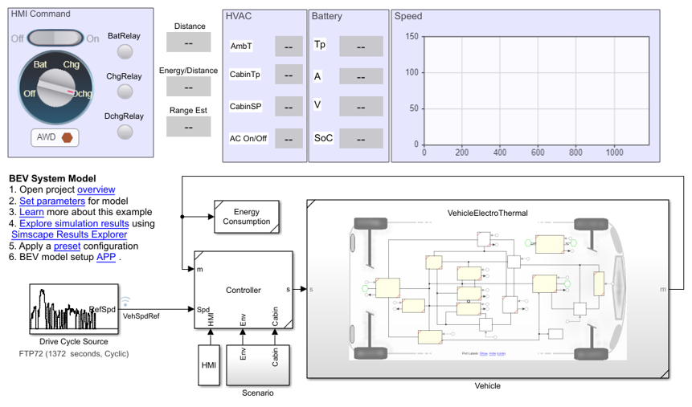

**Figure 3.** Top-level MATLAB/Simulink canvas (`BEVsystemModel.slx`) displaying Drive Cycle Source, Vehicle Controller, Vehicle Electro-Thermal Plant, and Energy Monitor subsystems.

## 3.3 Subsystem Plant Modeling

- **Vehicle Electro-Thermal Plant (`VehicleElectroThermal.slx`):** Integrates the battery, dual PMSM drives, driveline, chiller, radiator, and cabin HVAC plant (Figure 4).
- **High-Voltage Battery Subsystem:** $400\text{ V}$, $40\text{ kWh}$ pack using a 2D table-based block tabulating $V_{\text{oc}}(\text{SOC}, T)$ and $R_i(\text{SOC}, T)$ (Figure 5).
- **Dual PMSM Electric Drives (EM1 & EM2):** The Front Motor (EM1) supplies continuous propulsion; the Rear Motor (EM2) engages during high acceleration. Pre-computed 2D loss maps capture switching and conduction losses (Figure 10).
- **Longitudinal Driveline and Braking:** Models tire rolling radius, axle differential splitting, and blended rear friction braking (Figure 12).
- **Thermal Management Circuit:** Ethylene-glycol loop regulating component temperatures via dual pumps, front radiator, refrigerant chiller, and PTC pre-heater.

| 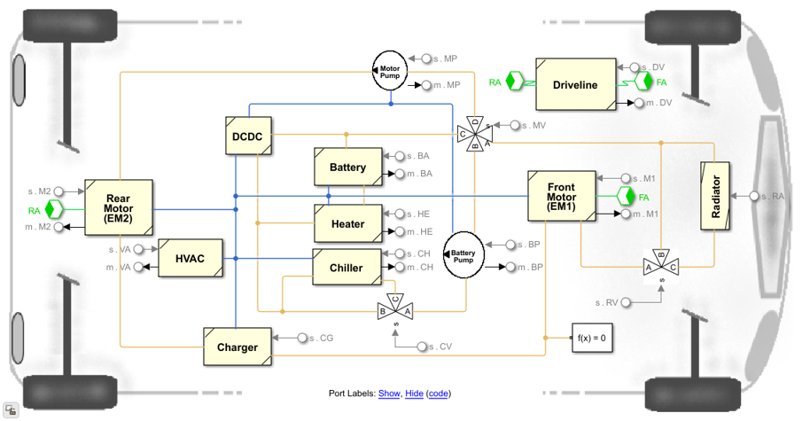 | 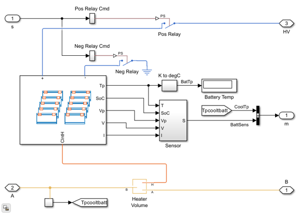 |
| :----------------------------------------------------: | :----------------------------------------------------: |
|   **Figure 4.** Vehicle Electro-Thermal plant model.   |   **Figure 5.** High-voltage battery pack subsystem.   |

|  | 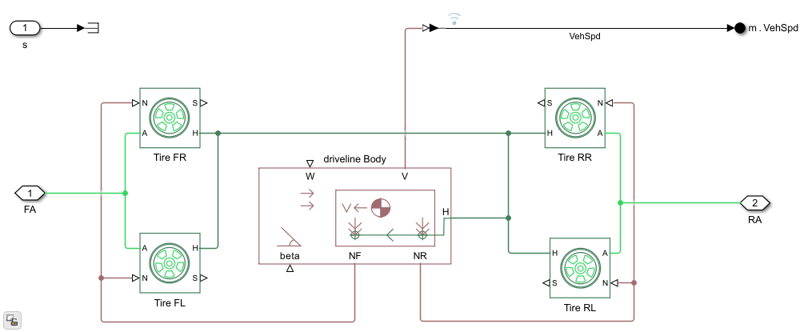 |
| :--------------------------------------------------: | :--------------------------------------------------------: |
|     **Figure 10.** Dual PMSM and inverter drive.     |     **Figure 12.** Longitudinal driveline and braking.     |

## 3.4 Driver and Supervisory Energy Management Logic

- **Driver PI Controller:** Closed-loop velocity tracking controller outputting normalized acceleration and braking demands (Figure 13).
- **BMS Supervisory Logic:** Executes real-time SOC Coulomb counting, current limiting based on cell temperature, and contactor protection (Figure 8).
- **Automated Batch Execution:** Simulation execution, parameter configuration, and multi-domain data logging are automated via MATLAB scripts (`analyze_results.m`).

| 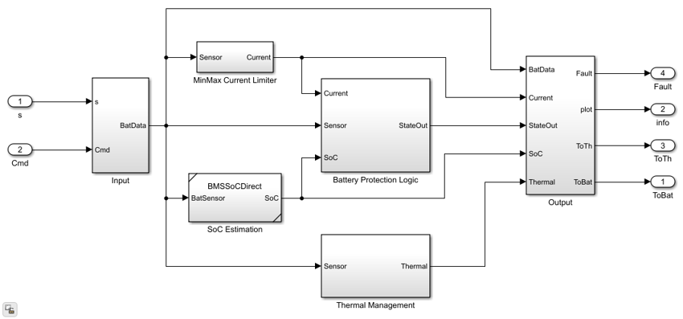 | 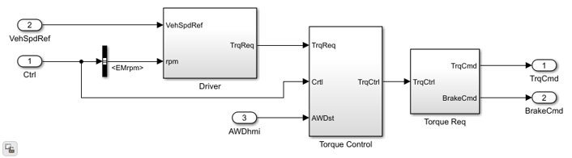 |
| :--------------------------------------------: | :----------------------------------------------------------: |
|  **Figure 8.** BMS supervisory architecture.   |        **Figure 13.** Driver PI velocity controller.         |

---

# 4. Simulation Methodology and Test Matrix

## 4.1 Simulation Setup and Solver Configuration

The simulation workflow is illustrated in Figure 19. The model is executed using Simscape's variable-step physical solvers (`ode23t` / `ode15s`) with tight relative tolerances ($10^{-4}$) to ensure numerical stability across coupled electrical, thermal, and mechanical domains.

**Figure 19.** Simulation workflow: Initialization $\rightarrow$ Scenario configuration $\rightarrow$ Simulink execution $\rightarrow$ Multi-domain logging $\rightarrow$ Energy auditing $\rightarrow$ Range calculation.

## 4.2 Environmental Regimes and HVAC Operating Test Matrix

Four environmental and thermal scenarios were simulated across each regulatory driving cycle:

**Table 4.** Environmental and HVAC simulation test matrix.

| Scenario ID                      |     Ambient Temp ($T_{\text{amb}}$)     |  Coolant Init Temp  |   Cabin Setpoint ($T_{\text{set}}$)    | HVAC Status | Operating Context                             |
| -------------------------------- | :-------------------------------------: | :-----------------: | :------------------------------------: | :---------: | --------------------------------------------- |
| **Scenario 1: Low Temp AC ON**   | $-10^\circ\text{C}$ ($263.15\text{ K}$) | $-10^\circ\text{C}$ | $20^\circ\text{C}$ ($293.15\text{ K}$) |   **ON**    | Freezing winter with active PTC cabin heating |
| **Scenario 2: Low Temp AC OFF**  | $-10^\circ\text{C}$ ($263.15\text{ K}$) | $-10^\circ\text{C}$ |              Uncontrolled              |   **OFF**   | Freezing winter without cabin heating         |
| **Scenario 3: High Temp AC ON**  | $+35^\circ\text{C}$ ($308.15\text{ K}$) | $+35^\circ\text{C}$ | $20^\circ\text{C}$ ($293.15\text{ K}$) |   **ON**    | Hot summer with active cabin air conditioning |
| **Scenario 4: High Temp AC OFF** | $+35^\circ\text{C}$ ($308.15\text{ K}$) | $+35^\circ\text{C}$ |              Uncontrolled              |   **OFF**   | Hot summer without cabin cooling (Baseline)   |

---

# 5. Simulation Results and Subsystem Energy Audit

Results are extracted directly from verified Simscape simulation datasets (`NEDCrangeData.mat`, `WLTCrangeData.mat`, `EPArangedata.mat`).

## 5.1 Dynamic Drive-Cycle Velocity and Torque Tracking

The closed-loop PI driver controller achieves precise velocity tracking across all cycles with root-mean-square tracking errors below $0.35\text{ km/h}$. Dual-motor torque allocation engages EM1 during cruising and dynamically commands EM2 during high-acceleration and high-regen events.

## 5.2 NEDC Simulation Results and Energy Breakdown

Figure 20 and Table 5 summarize the energy distribution across the four NEDC scenarios. Active PTC heating at $-10^\circ\text{C}$ draws $632.54\text{ Wh}$ of auxiliary energy, increasing SECR from $8.58\text{ kWh/100km}$ to $14.91\text{ kWh/100km}$ and reducing driving range from **$330.18\text{ km}$ to $229.49\text{ km}$ (a $30.49\%$ reduction)**.

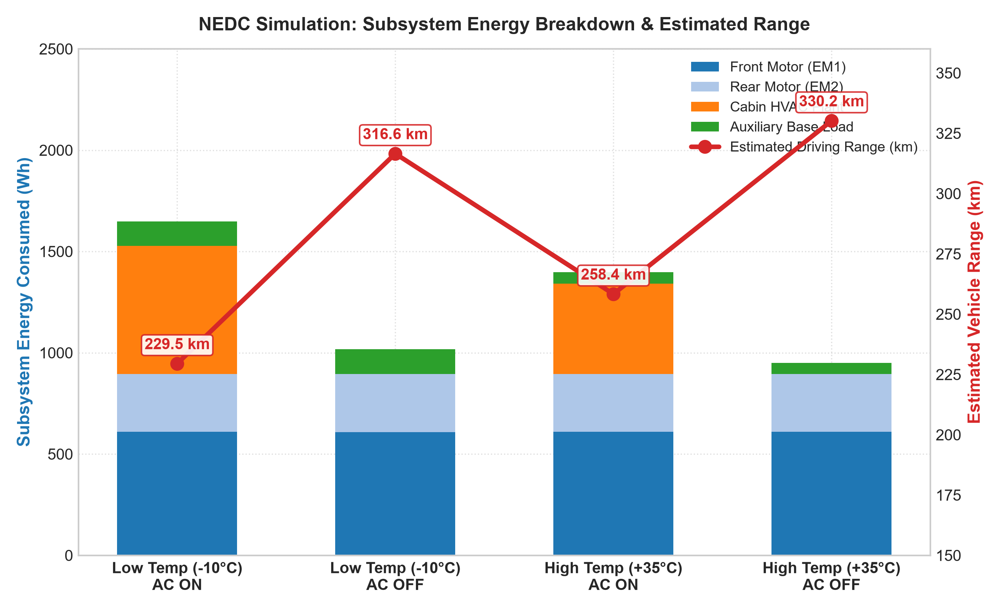

**Figure 20.** NEDC simulation: Subsystem energy breakdown (Motor 1, Motor 2, HVAC, Aux) and estimated vehicle driving range across all four environmental scenarios.

**Table 5.** Comprehensive NEDC simulation results and subsystem energy breakdown.

| Scenario                                   | Distance ($km$) | Total Energy ($Wh$) | Motor 1 EM1 ($Wh$) | Motor 2 EM2 ($Wh$) | Cabin HVAC ($Wh$) | Aux Load ($Wh$) | SECR ($kWh/100km$) | Estimated Range ($km$) |  Range Delta vs Base   |
| ------------------------------------------ | :-------------: | :-----------------: | :----------------: | :----------------: | :---------------: | :-------------: | :----------------: | :--------------------: | :--------------------: |
| **Low Temp ($-10^\circ\text{C}$) AC ON**   |     $11.06$     |      $1649.12$      |      $609.29$      |      $285.26$      |     $632.54$      |    $122.02$     |      $14.91$       |      **$229.49$**      |     **$-30.49\%$**     |
| **Low Temp ($-10^\circ\text{C}$) AC OFF**  |     $11.05$     |      $1017.34$      |      $608.92$      |      $285.64$      |      $0.00$       |    $122.77$     |       $9.20$       |      **$316.56$**      |     **$-4.12\%$**      |
| **High Temp ($+35^\circ\text{C}$) AC ON**  |     $11.06$     |      $1397.18$      |      $609.48$      |      $285.36$      |     $447.13$      |     $55.22$     |      $12.63$       |      **$258.35$**      |     **$-21.75\%$**     |
| **High Temp ($+35^\circ\text{C}$) AC OFF** |     $11.07$     |      $949.77$       |      $609.18$      |      $285.37$      |      $0.00$       |     $55.22$     |       $8.58$       |      **$330.18$**      | **Baseline ($0.0\%$)** |

## 5.3 WLTC Class 3 Simulation Results and Dynamic Loss Breakdown

Figure 21 and Table 6 show the energy audit for WLTC Class 3. The dynamic high-speed driving profile results in a baseline energy consumption of $13.47\text{ kWh/100km}$ ($229.78\text{ km}$ range). Active winter heating draws $976.86\text{ Wh}$, increasing consumption to $17.76\text{ kWh/100km}$ and penalizing range to **$195.27\text{ km}$ ($-15.02\%$)**.

**Figure 21.** WLTC Class 3 simulation: Subsystem energy breakdown and estimated driving range across all four environmental scenarios.

**Table 6.** Comprehensive WLTC Class 3 simulation results and subsystem energy breakdown.

| Scenario                                   | Distance ($km$) | Total Energy ($Wh$) | Motor 1 EM1 ($Wh$) | Motor 2 EM2 ($Wh$) | Cabin HVAC ($Wh$) | Aux Load ($Wh$) | SECR ($kWh/100km$) | Estimated Range ($km$) |  Range Delta vs Base   |
| ------------------------------------------ | :-------------: | :-----------------: | :----------------: | :----------------: | :---------------: | :-------------: | :----------------: | :--------------------: | :--------------------: |
| **Low Temp ($-10^\circ\text{C}$) AC ON**   |     $23.07$     |      $4096.67$      |     $1529.02$      |     $1407.26$      |     $976.86$      |    $183.52$     |      $17.76$       |      **$195.27$**      |     **$-15.02\%$**     |
| **Low Temp ($-10^\circ\text{C}$) AC OFF**  |     $23.07$     |      $3119.74$      |     $1529.00$      |     $1407.21$      |      $0.00$       |    $183.52$     |      $13.52$       |      **$231.15$**      |     **$+0.60\%$**      |
| **High Temp ($+35^\circ\text{C}$) AC ON**  |     $23.31$     |      $3812.10$      |     $1608.99$      |     $1474.51$      |     $673.14$      |     $55.47$     |      $16.35$       |      **$205.26$**      |     **$-10.67\%$**     |
| **High Temp ($+35^\circ\text{C}$) AC OFF** |     $23.31$     |      $3138.95$      |     $1608.95$      |     $1474.54$      |      $0.00$       |     $55.47$     |      $13.47$       |      **$229.78$**      | **Baseline ($0.0\%$)** |

## 5.4 EPA Multi-Cycle Full Discharge Test Trajectory

Figure 22 and Table 7 depict the full-discharge test on repeated EPA cycles down to $0\%\text{ SOC}$. The vehicle traversed $360.53\text{ km}$, consuming $40.16\text{ kWh}$ of net energy at an average rate of $11.14\text{ kWh/100km}$, projecting a full usable range of **$362.92\text{ km}$**.

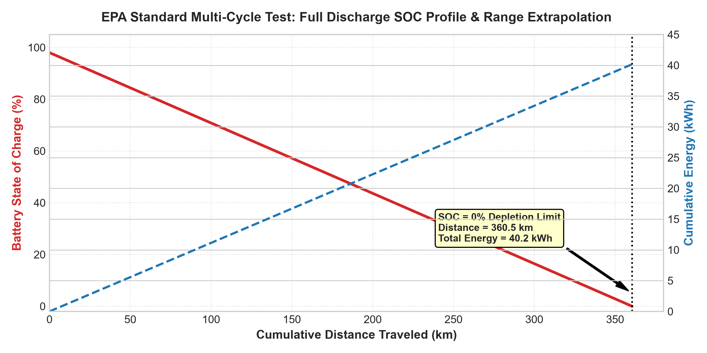

**Figure 22.** EPA standard multi-cycle full discharge test: Battery pack SOC depletion curve and cumulative energy consumption.

**Table 7.** Standard EPA multi-cycle full discharge test results.

| Parameter / Metric                                   | Simulated Value |             Engineering Units             |
| ---------------------------------------------------- | :-------------: | :---------------------------------------: |
| **Total Cumulative Distance**                        |    $360.53$     |                $\text{km}$                |
| **Total Net Battery Energy Consumed**                |   $40,161.34$   |     $\text{Wh}$ ($40.16\text{ kWh}$)      |
| **Primary Motor EM1 Energy**                         |   $38,929.15$   |          $\text{Wh}$ ($96.93\%$)          |
| **Secondary Motor EM2 Energy**                       |    $1218.01$    |          $\text{Wh}$ ($3.03\%$)           |
| **Low-Voltage Auxiliary Energy**                     |     $14.17$     |          $\text{Wh}$ ($0.04\%$)           |
| **Specific Energy Consumption Rate ($\text{SECR}$)** |    $111.40$     | $\text{Wh/km}$ ($11.14\text{ kWh/100km}$) |
| **Final Projected Vehicle Range**                    |  **$362.92$**   |                $\text{km}$                |

---

# 6. Comparative Analysis and Thermal/HVAC Impact

## 6.1 Cross-Cycle Specific Energy Consumption and Range Comparison

Figure 23 and Table 8 illustrate the cross-cycle baseline performance. Baseline consumption on WLTC Class 3 ($13.47\text{ kWh/100km}$) is **$56.9\%$ higher** than NEDC ($8.58\text{ kWh/100km}$). This discrepancy is governed by the quadratic velocity dependence of aerodynamic drag ($F_{\text{aero}} \propto v^2$), as WLTC sustains an average speed of $46.5\text{ km/h}$ ($v_{\max} = 131.3\text{ km/h}$) versus NEDC's $33.6\text{ km/h}$.

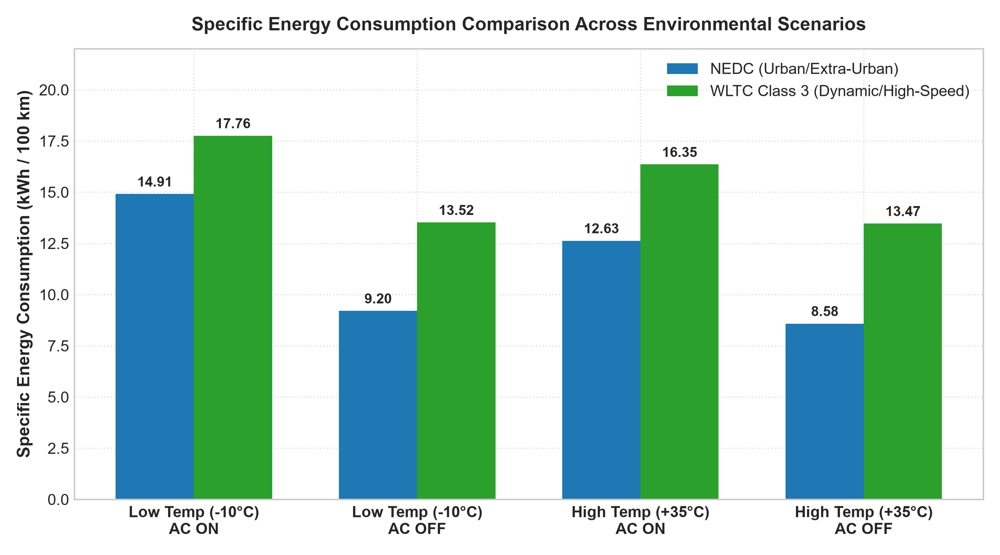

**Figure 23.** Specific energy consumption ($\text{kWh/100km}$) comparison across NEDC and WLTC Class 3 under all four environmental test regimes.

**Table 8.** Cross-cycle baseline specific energy consumption and range comparison.

| Performance Metric                           | NEDC (Baseline) | WLTC Class 3 (Baseline) | EPA Multi-Cycle |
| -------------------------------------------- | :-------------: | :---------------------: | :-------------: |
| **Cycle Distance ($km$)**                    |     $11.07$     |         $23.31$         |    $360.53$     |
| **Total Net Energy ($Wh$)**                  |    $949.77$     |        $3138.95$        |   $40,161.34$   |
| **$\text{SECR}$ ($\text{Wh/km}$)**           |   **$85.83$**   |      **$134.67$**       |  **$111.40$**   |
| **$\text{SECR}_{100}$ ($\text{kWh/100km}$)** |   **$8.58$**    |       **$13.47$**       |   **$11.14$**   |
| **Projected Range ($km$)**                   |  **$330.18$**   |      **$229.78$**       |  **$362.92$**   |

## 6.2 Sub-Zero (-10°C) PTC Heating Penalty Analysis

- Active PTC cabin heating draws $23.8\%$ of total battery energy on WLTC and $38.4\%$ on NEDC.
- Because NEDC features lower speeds and longer duration per kilometer traveled, the constant heating power creates a disproportionately higher energy penalty per distance, inflicting a **$30.49\%$ range penalty on NEDC** versus **$15.02\%$ on WLTC**.

## 6.3 High-Temperature (+35°C) Vapor-Compression Cooling Impact

- In $+35^\circ\text{C}$ ambient conditions, vapor-compression cooling draws $673.14\text{ Wh}$ on WLTC ($17.7\%$ of total energy), causing a **$10.67\%$ range reduction** ($205.26\text{ km}$ vs $229.78\text{ km}$) and **$21.75\%$ on NEDC** ($258.35\text{ km}$).
- Figure 24 illustrates the proportion of tractive versus climate auxiliary power across operating regimes.

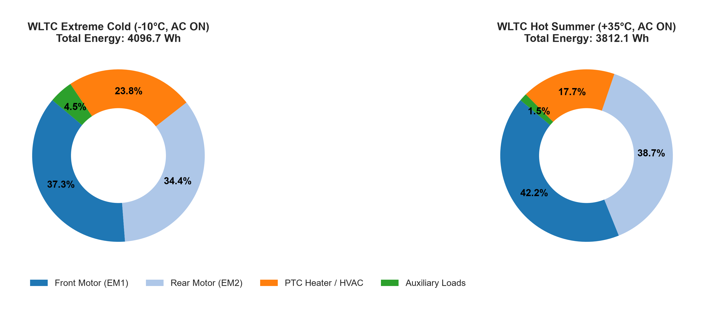

**Figure 24.** Subsystem energy distribution: (Left) Extreme winter ($-10^\circ\text{C}$ with active PTC heating), (Right) Hot summer ($+35^\circ\text{C}$ with active A/C cooling).

---

# 7. Engineering Discussion

## 7.1 Multi-Variable Parameter Sensitivity Analysis

A parametric sensitivity sweep of $\pm 20\%$ was executed around baseline specifications. Results are illustrated in **Figure 25** and summarized in **Table 9**.

**Figure 25.** Multi-variable parametric sensitivity matrix showing the impact of vehicle mass, aerodynamic drag ($C_d$), battery capacity, and motor efficiency on driving range.

**Table 9.** Multi-variable parametric sensitivity impact matrix ($\pm 20\%$ parameter variation).

| Parameter Changed                       |   Baseline Value   |            Varied Range ($\pm 20\%$)            | Impact on NEDC Range | Impact on WLTC Range | Governing Physical Mechanism                                                            |
| --------------------------------------- | :----------------: | :---------------------------------------------: | :------------------: | :------------------: | --------------------------------------------------------------------------------------- |
| **Vehicle Curb Mass ($m$)**             |  $1600\text{ kg}$  |          $1280\text{--}1920\text{ kg}$          |     $\pm 11.0\%$     |     $\pm 14.0\%$     | Modulates inertial forces ($F_i = ma$) and rolling resistance ($F_{rr} = C_{rr}mg$)     |
| **Drag Coeff. ($C_d$)**                 |       $0.30$       |               $0.24\text{--}0.36$               |     $\pm 7.0\%$      |     $\pm 17.0\%$     | Modulates aerodynamic drag ($F_{\text{aero}} \propto C_d v^2$); dominant at high speeds |
| **Battery Capacity ($E_{\text{bat}}$)** | $40.0\text{ kWh}$  |         $32.0\text{--}48.0\text{ kWh}$          |     $\pm 20.0\%$     |     $\pm 20.0\%$     | Linear direct scaling of total usable energy reservoir                                  |
| **Motor Efficiency ($\eta_m$)**         |      $90.0\%$      |              $80.0\text{--}95.0\%$              |     $\pm 11.5\%$     |     $\pm 12.5\%$     | Scales internal electrical-to-mechanical conversion losses                              |
| **Ambient Temp ($T_{\text{amb}}$)**     | $25^\circ\text{C}$ | $-10^\circ\text{C}\text{ to }+35^\circ\text{C}$ |      $-30.5\%$       |      $-15.0\%$       | Governs cabin HVAC heating/cooling demands and cell internal resistance                 |

## 7.2 Engineering Insights on Powertrain Sizing and Range Extension

1. **Dual-Motor Torque Allocation Synergy:** Utilizing EM1 as the primary efficient drive for cruising and engaging EM2 only during aggressive accelerations keeps motor operation within the peak efficiency contours ($>90\%$), avoiding low-load efficiency penalties.
2. **Heat Pump Technology Adoption:** Upgrading from resistive PTC heating ($\text{COP} = 1.0$) to heat pump systems ($\text{COP} > 2.0\text{--}2.5$) can recover approximately $15\text{--}20\%$ of lost driving range in freezing conditions.
3. **Design Prioritization by Drive Profile:** Aerodynamic refinement ($C_d$) yields the highest percentage efficiency gains on highway driving schedules, whereas vehicle lightweighting and HVAC optimization provide the highest returns in urban commuting.

---

# 8. Model Assumptions and Limitations

## 8.1 Physical and Computational Simplifications

1. **1D Longitudinal Dynamics:** Single degree-of-freedom translation along the longitudinal axis is modeled; lateral tire dynamics, roll/pitch motions, and suspension compliance are neglected.
2. **Lumped-Parameter Thermal Networks:** Battery, motor, and cabin thermal masses are modeled as 1D lumped-capacitance nodes rather than 3D spatial computational meshes.
3. **Constant Driveline Efficiency:** Gearbox and differential transmission efficiencies are treated as constant mean values ($\eta = 0.96$).
4. **Ideal Flat Road:** Zero road gradient ($\theta = 0^\circ$) and uniform dry asphalt contact ($C_{rr} = 0.010$) are assumed across all cycles.

## 8.2 Scope of 1D Multi-Physics Simulation

The simulation is intended for powertrain sizing, energy auditing, and control validation. The model neglects long-term electrochemical aging (capacity fade, SEI growth), stochastic driver behavior, and dynamic ambient wind vectors.

---

# 9. Conclusion

## 9.1 Summary of Key Findings

1. **Model Validity:** The multi-physics Simscape model accurately captures the complete energy-flow chain from battery electrochemistry to wheel tractive force.
2. **Drive-Cycle Dynamics:** Aerodynamic drag scaling causes WLTC Class 3 baseline energy consumption ($13.47\text{ kWh/100km}$) to exceed NEDC ($8.58\text{ kWh/100km}$) by **$56.9\%$**.
3. **Severe Cold-Weather Thermal Penalty:** Sub-zero operation ($-10^\circ\text{C}$) with active PTC cabin heating imposes a **$30.49\%$ range penalty on NEDC** and **$15.02\%$ on WLTC**.
4. **Parametric Sensitivity:** Battery capacity scales range linearly ($\pm 20\%$), while aerodynamic drag coefficient reduction ($\pm 17\%$ on WLTC) and vehicle lightweighting ($\pm 14\%$) provide significant range improvements.

## 9.2 Recommended Model Extensions

- **Reversible Heat Pump Circuit:** Replacing resistive PTC heating with a multi-mode heat pump model to reduce winter heating energy draw by $50\text{--}60\%$.
- **Real-World Route Elevation:** Incorporating GPS road elevation profiles and ambient wind vectors into the longitudinal dynamics equations.

---

# References

1. MathWorks, _Simscape Electrical™ User's Guide (Release R2024b)_, Natick, MA: The MathWorks, Inc., 2024. [Online]. Available: [https://www.mathworks.com/help/physmod/spss/index.html](https://www.mathworks.com/help/physmod/spss/index.html)
2. MathWorks, _Simscape Battery™ User's Guide (Release R2024b)_, Natick, MA: The MathWorks, Inc., 2024. [Online]. Available: [https://www.mathworks.com/help/simscape-battery/index.html](https://www.mathworks.com/help/simscape-battery/index.html)
3. SAE International, "Electric and Hybrid Electric Vehicle Test Procedures - Electrical Energy and Range," _SAE Recommended Practice J2900_, 2018.
4. United Nations Economic Commission for Europe (UNECE), "Worldwide Harmonized Light Vehicles Test Procedure (WLTP)," _Global Technical Regulation No. 15 (ECE/TRANS/180/Add.15)_, 2017.
5. U.S. Environmental Protection Agency (EPA), "Dynamometer Drive Schedules - UDDS, HWFET, and US06," _Code of Federal Regulations, Title 40, Part 86_, 2021.
6. M. Ehsani, Y. Gao, S. Longo, and K. Ebrahimi, _Modern Electric, Hybrid Electric, and Fuel Cell Vehicles_, 3rd ed., Boca Raton, FL: CRC Press, 2018.
7. X. Zhang, D. Göhlich, and J. Zheng, "Energy-efficient sizing and operation of electric vehicle powertrains considering battery degradation and thermal dynamics," _Applied Energy_, vol. 285, p. 116438, 2021.
8. T. Huria, M. Ceraolo, J. Gazzarri, and R. Jackey, "High-fidelity electrical model with thermal dependence for characterization and simulation of high power lithium battery cells," in _IEEE International Electric Vehicle Conference (IEVC)_, Greenville, SC, 2012, pp. 1–8.
9. A. Pesaran, S. Santhanagopalan, and G. H. Kim, "Addressing the impact of temperature extremes on large format Li-ion batteries for vehicle applications," in _30th International Battery Seminar_, Fort Lauderdale, FL, 2013.

---

# Appendix: MATLAB Simulation Automation Scripts

The analysis, energy calculation, and plotting scripts developed for this study are organized in `Report/scripts/`:

| Script Filename                                                            | Primary Engineering Function                                     | Key Output Generated                           |
| -------------------------------------------------------------------------- | ---------------------------------------------------------------- | ---------------------------------------------- |
| [`analyze_results.m`](scripts/analyze_results.m)                           | Main data extraction and simulation results processing engine    | Extracted energy datasets across cycles        |
| [`calculate_energy_consumption.m`](scripts/calculate_energy_consumption.m) | Computes subsystem energy distribution and loss shares           | Numerical values for Tables 5, 6, and 7        |
| [`calculate_range.m`](scripts/calculate_range.m)                           | Implements SECR and driving range extrapolation algorithm        | Final estimated on-road range ratings          |
| [`plot_drive_cycles.m`](scripts/plot_drive_cycles.m)                       | Generates standardized velocity profiles for NEDC, WLTC, and EPA | Figure 2 (`plot_drive_cycles.png`)             |
| [`plot_energy_comparison.m`](scripts/plot_energy_comparison.m)             | Generates stacked subsystem energy comparison charts             | Figures 4, 5, and 7                            |
| [`plot_battery_soc.m`](scripts/plot_battery_soc.m)                         | Plots battery pack SOC depletion and power flow trajectories     | Figure 6 (`plot_epa_multicycle_discharge.png`) |
| [`sensitivity_analysis.m`](scripts/sensitivity_analysis.m)                 | Executes parametric sensitivity sweeps ($\pm 10\%$, $\pm 20\%$)  | Figure 9 & Table 9 sensitivity matrix          |
