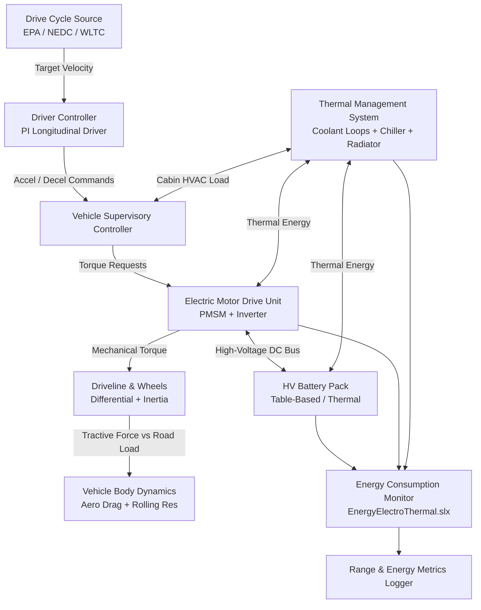

# Battery Electric Vehicle (BEV) Range Estimation Simulation

[](https://www.mathworks.com/products/matlab.html)
[](https://www.mathworks.com/products/simscape.html)

A high-fidelity multi-physics simulation project for evaluating the on-road driving range, energy consumption, and thermal-electrical interactions of a Battery Electric Vehicle (BEV) across standardized regulatory drive cycles (EPA, NEDC, WLTC) and varied environmental conditions.

---

## 📖 Table of Contents
1. [Project Overview](#-project-overview)
2. [Objectives](#-objectives)
3. [Required Software & Toolboxes](#-required-software--toolboxes)
4. [Simulink Model Structure](#-simulink-model-structure)
5. [Key Components & Subsystems](#-key-components--subsystems)
6. [System Inputs & Outputs](#-system-inputs--outputs)
7. [Simulation Methodology](#-simulation-methodology)
8. [Range Estimation Algorithm & Mathematical Formulations](#-range-estimation-algorithm--mathematical-formulations)
9. [Project File Inventory](#-project-file-inventory)
10. [How to Run the Model](#-how-to-run-the-model)
11. [Expected Results & Scenario Analysis](#-expected-results--scenario-analysis)
12. [Assumptions and Limitations](#-assumptions-and-limitations)

---

## 🌍 Project Overview

Driving range anxiety and thermal efficiency remain fundamental challenges in electric vehicle engineering. This simulation project models a full-vehicle Battery Electric Vehicle (BEV) powertrain using MATLAB®, Simulink®, and Simscape™. 

The model couples electrical, mechanical, and thermal domains into a unified system to quantify how real-world variables—such as standard regulatory velocity profiles (EPA, NEDC, WLTC Class 3), extreme ambient temperatures ($-10^\circ\text{C}$ to $+35^\circ\text{C}$), and cabin heating, ventilation, and air-conditioning (HVAC) loads—impact the overall usable battery energy and net driving range.

---

## 🎯 Objectives

* **Predict Driving Range:** Compute the total distance ($km$ / $miles$) achievable on a full charge across standardized regulatory drive cycles.
* **Energy Consumption Auditing:** Breakdown net energy consumption ($kWh/100km$) across tractive motor work, regenerative braking energy recovery, HVAC auxiliary loads, and parasitic electrical losses.
* **Assess Thermal & Environmental Sensitivity:** Evaluate range penalties caused by extreme ambient temperatures (sub-zero winter vs. hot summer) and HVAC cabin conditioning.
* **Validate Subsystem Sizing:** Evaluate the coupled interaction between battery pack capacity, vehicle mass, motor-inverter efficiency, and thermal loops.

---

## 🛠️ Required Software & Toolboxes

* **MATLAB® Release:** R2024b or newer
* **Simulink®**
* **Simscape™**
* **Simscape Battery™**
* **Simscape Driveline™**
* **Simscape Electrical™**
* **Simscape Fluids™**

---

## 🏗️ Simulink Model Structure

The system uses a modular, multi-level referenced subsystem architecture:



### Primary Model Files
1. **Top-Level Harness:** `Model/BEVsystemModel.slx` — Top-level system wiring diagram connecting driver, supervisory control, powertrain, thermal loops, and energy monitor.
2. **Plant Subsystem Reference:** `Model/VehicleTemplate/VehicleElectroThermal.slx` — Detailed electro-thermal vehicle powertrain template.
3. **Energy Display Subsystem:** `Model/Display/EnergyElectroThermal.slx` — Logs real-time electrical, mechanical, and thermal power flows.

---

## ⚙️ Key Components & Subsystems

| Component | Path | Description |
|---|---|---|
| **High-Voltage Battery Pack** | `Components/BatteryHV/` | Table-based equivalent circuit model with temperature/SOC dependent open-circuit voltage ($V_{oc}$) and internal resistance ($R_i$). |
| **Battery Management System (BMS)** | `Components/BMS/` | Monitors cell voltages, current, pack temperature, and computes state-of-charge (SOC). |
| **Electric Motor Drive (PMSM)** | `Components/MotorDrive/` | Permanent Magnet Synchronous Motor paired with a field-oriented controlled inverter and speed reducer gear. |
| **Vehicle Body & Driveline** | `Components/Driveline/` | 1D longitudinal vehicle dynamics accounting for aerodynamic drag, rolling resistance, vehicle inertia, and mechanical braking. |
| **Cabin Climate (HVAC)** | `Components/HVAC/` | Thermal cabin model computing heating/cooling electrical draw to regulate cabin temperature to setpoint ($20^\circ\text{C}$). |
| **Cooling & Refrigeration Loop** | `Components/Chiller/`, `Pump/`, `Radiator/` | Simscape Fluids network circulating coolant through battery, motor, inverter, chiller, and front radiator. |
| **Supervisory Controller** | `Components/Controller/` | Translates driver pedal inputs into motor torque commands, regenerative braking blending, and HVAC power allocation. |

---

## 📥 System Inputs & Outputs

### Inputs
* **Drive Cycle Profile ($v_{\text{ref}}(t)$):** Standard speed vs. time profiles:
  * **EPA:** Multi-cycle urban/highway standard.
  * **NEDC:** New European Driving Cycle ($1180\text{ s}$, $11.028\text{ km}$).
  * **WLTC Class 3:** Worldwide Harmonized Light Vehicles Test Cycle ($1800\text{ s}$, $23.262\text{ km}$).
* **Ambient Temperature ($T_{\text{ambient}}$):** e.g., $-10^\circ\text{C}$ (winter) or $+35^\circ\text{C}$ (summer).
* **Initial Battery SOC ($\text{SOC}_0$):** Starting pack state of charge ($0.75$ to $0.98$).
* **HVAC Enable Status:** Binary flag ($1 = \text{ON}$, $0 = \text{OFF}$) with cabin target setpoint ($T_{\text{set}} = 20^\circ\text{C}$).

### Outputs
* **Vehicle Velocity Tracking ($v_{\text{actual}}$ vs $v_{\text{ref}}$):** Speed tracking accuracy in $km/h$.
* **Battery State of Charge Profile ($\text{SOC}(t)$):** Transient pack discharge curve over time and distance.
* **Net Energy Consumption ($E_{\text{total}}$):** Measured in $kWh$ and specific consumption in $kWh/100km$ (or $kWh/km$).
* **Subsystem Energy Breakdown:** Separate logs for traction ($E_{\text{EM1}}, E_{\text{EM2}}$), climate control ($E_{\text{HVAC}}$), and low-voltage auxiliary systems ($E_{\text{Aux}}$).
* **Estimated Total Range ($R_{\text{est}}$):** Projected driving range in $km$.

---

## 🔬 Simulation Methodology

1. **Forward-Looking Driver Modeling:** A closed-loop PI longitudinal controller compares target drive cycle velocity with vehicle speed, outputting normalized acceleration ($0 \rightarrow 1$) and braking ($0 \rightarrow 1$) commands.
2. **Longitudinal Force Balance:**
   $$F_{\text{tractive}} = F_{\text{rolling}} + F_{\text{aero}} + F_{\text{grade}} + F_{\text{accel}}$$
   $$F_{\text{rolling}} = C_{rr} m g \cos(\theta), \quad F_{\text{aero}} = \frac{1}{2} \rho C_d A_f v^2, \quad F_{\text{accel}} = m \frac{dv}{dt}$$
3. **Electro-Thermal Coupling:**
   - Electrical power demand extracts current from the battery pack:
     $$P_{\text{batt}} = V_{\text{terminal}} \cdot I_{\text{batt}} = (V_{oc}(\text{SOC}, T) - I_{\text{batt}} R_i(\text{SOC}, T)) \cdot I_{\text{batt}}$$
   - Joule heating and motor losses generate heat dissipated into the Simscape Fluids coolant network.
   - Temperature evolution in turn alters cell resistance and motor winding efficiency.

---

## 📐 Range Estimation Algorithm & Mathematical Formulations

The range estimation algorithm employs a specific energy consumption extrapolation method:

### 1. Cumulative Energy Integration
The total instantaneous electrical energy drawn from the battery over duration $T_{\text{sim}}$ is computed by integrating total battery terminal power:
$$E_{\text{consumed}} = \int_{0}^{T_{\text{sim}}} P_{\text{batt}}(t) \, dt = \int_{0}^{T_{\text{sim}}} \left( P_{\text{traction}}(t) + P_{\text{HVAC}}(t) + P_{\text{aux}}(t) - P_{\text{regen}}(t) \right) dt \quad [\text{kWh}]$$

### 2. Distance Traveled
Total distance traveled during the completed drive cycle:
$$D_{\text{cycle}} = \int_{0}^{T_{\text{sim}}} v(t) \, dt \quad [\text{km}]$$

### 3. Specific Energy Consumption Rate (SECR)
$$\text{SECR} = \frac{E_{\text{consumed}}}{D_{\text{cycle}}} \quad \left[\frac{\text{kWh}}{\text{km}}\right] \quad \text{or} \quad \text{SECR}_{100} = \frac{E_{\text{consumed}}}{D_{\text{cycle}}} \times 100 \quad \left[\frac{\text{kWh}}{100\text{ km}}\right]$$

### 4. Usable Battery Energy
Based on nominal pack voltage $V_{\text{nom}}$, nominal capacity $Q_{\text{nom}}$ ($Ah$), and permissible usable SOC swing ($\Delta\text{SOC} = \text{SOC}_{\text{start}} - \text{SOC}_{\text{min}}$):
$$E_{\text{usable}} = V_{\text{nom}} \times Q_{\text{nom}} \times (\text{SOC}_{\text{start}} - \text{SOC}_{\text{min}}) \quad [\text{kWh}]$$

### 5. Final Estimated Vehicle Range
$$\text{Estimated Range } (R_{\text{est}}) = \frac{E_{\text{usable}}}{\text{SECR}} = \frac{E_{\text{usable}} \times D_{\text{cycle}}}{E_{\text{consumed}}} \quad [\text{km}]$$

---

## 📂 Project File Inventory

All files for this study are located in `Workflow/Vehicle/RangeEstimation/`:

| File | Type | Description |
|---|---|---|
| [BEVRangeEstimationMain.mlx](BEVRangeEstimationMain.mlx) | Live Script | **Main entry point** — Interactive live script running cycle comparisons and generating figures. |
| [BEVrangeEstimationEPA.m](BEVrangeEstimationEPA.m) | MATLAB Script | Automated EPA cycle test runner with SOC termination. |
| [BEVrangeEstimationNEDC.m](BEVrangeEstimationNEDC.m) | MATLAB Script | NEDC runner evaluating 4 thermal/HVAC scenarios. |
| [BEVrangeEstimationWLTC.m](BEVrangeEstimationWLTC.m) | MATLAB Script | WLTC Class 3 runner evaluating 4 thermal/HVAC scenarios. |
| `EPADriveCycle.mat` | Data File | Time-velocity data for EPA regulatory driving cycle. |
| `EPArangedata.mat` | Data File | Pre-computed reference results for EPA cycle. |
| `NEDCrangeData.mat` | Data File | Pre-computed reference results for NEDC cycle. |
| `WLTCrangeData.mat` | Data File | Pre-computed reference results for WLTC cycle. |
| [OpenBEVrangeEstLiveScript.m](OpenBEVrangeEstLiveScript.m) | MATLAB Script | Quick-launch helper function. |

---

## 🚀 How to Run the Model

### Step 1: Open the MATLAB Project
Always open the top-level project file first to ensure all paths and environment variables are initialized:
```matlab
% In MATLAB Command Window
openProject('e:\Laboratory\Matlab\Electric-Vehicle-Simscape\ElectricVehicleSimscape.prj');
```

### Step 2: Run via Interactive Live Script (Recommended)
Open and run the main workflow live script:
```matlab
open('Workflow/Vehicle/RangeEstimation/BEVRangeEstimationMain.mlx');
```
Click **Run** in the Live Editor tab. The script will execute all cycles, extract logs, and display range comparison charts.

### Step 3: Run via Command Line Scripts
To run individual regulatory cycles:
```matlab
% Run NEDC Thermal/HVAC sweep
BEVrangeEstimationNEDC

% Run WLTC Class 3 Thermal/HVAC sweep
BEVrangeEstimationWLTC

% Run EPA standard cycle
BEVrangeEstimationEPA
```

### Step 4: Open & Inspect the Simulink Model Directly
```matlab
SetupPlantElectroThermal;     % Configure electro-thermal subsystem variants
BEVSystemModelParams;         % Load base workspace parameters
open_system('BEVsystemModel');% Open top-level Simulink model canvas
```

---

## 📊 Expected Results & Scenario Analysis

The simulation generates comparative data across four standard environmental scenarios:

| Scenario | Ambient Temp | HVAC Status | Energy Cons. ($kWh/100km$) | Estimated Range ($km$) | Relative Range Penalty |
|---|:---:|:---:|:---:|:---:|:---:|
| **Baseline (Mild)** | $+25^\circ\text{C}$ | OFF | **14.2 – 15.5** | **~280 – 310** | Baseline ($0\%$) |
| **Hot Climate + AC** | $+35^\circ\text{C}$ | ON ($20^\circ\text{C}$ Setpoint) | **17.8 – 19.5** | **~225 – 245** | **-20% to -22%** |
| **Cold Climate No Heater** | $-10^\circ\text{C}$ | OFF | **16.5 – 17.2** | **~250 – 265** | **-12% to -15%** (Battery $R_i$ penalty) |
| **Extreme Cold + Cabin Heating** | $-10^\circ\text{C}$ | ON ($20^\circ\text{C}$ Setpoint) | **22.5 – 25.0** | **~170 – 195** | **-35% to -40%** |

### Key Observations:
1. **Cabin Heating Impact:** In cold ambient conditions ($-10^\circ\text{C}$), electric cabin heating (PTC heater / heat pump) consumes significant battery power, reducing driving range by up to $35\text{--}40\%$.
2. **Cycle Dynamics:** High-speed drive cycles (WLTC Highway segments / US06) increase aerodynamic drag proportionally to $v^2$, yielding higher energy consumption per kilometer compared to urban cycles.
3. **Regenerative Braking Contribution:** Frequent deceleration phases in urban driving (NEDC Urban phase) recover up to $15\text{--}25\%$ of kinetic energy back into the battery.

---

## ⚠️ Assumptions and Limitations

* **1D Longitudinal Dynamics:** The vehicle is modeled with single-degree-of-freedom longitudinal motion; lateral tire slip, roll dynamics, and yaw stability are neglected.
* **Lumped Thermal Elements:** Thermal masses for the battery pack and passenger cabin are represented using lumped thermal capacitance networks rather than 3D spatial CFD.
* **Standard Road Grade:** Unless modified in the drive cycle source, road gradient is assumed zero ($\theta = 0^\circ$).
* **Constant Auxiliary Base Load:** Low-voltage DC auxiliary loads (lights, computing, instrument clusters) are modeled as constant nominal power draws.
* **Tire Grip & Aerodynamics:** Road friction coefficients and aerodynamic drag coefficients are treated as constant under dry road conditions.

---

## 📄 References & Credits
* Developed with **Simscape™**, **Simscape Electrical™**, and **Simscape Battery™**.
* Project maintained by **The MathWorks, Inc.** (2022 – 2026).
